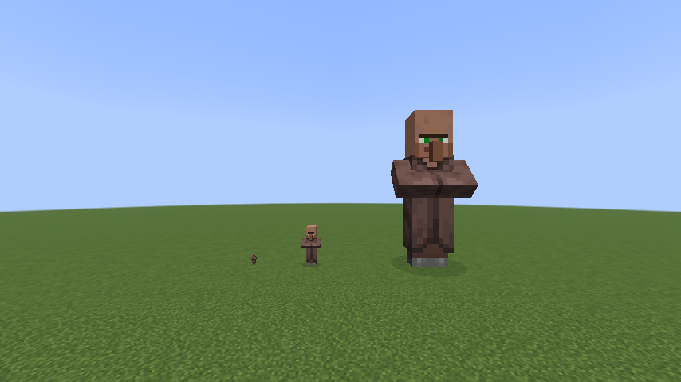
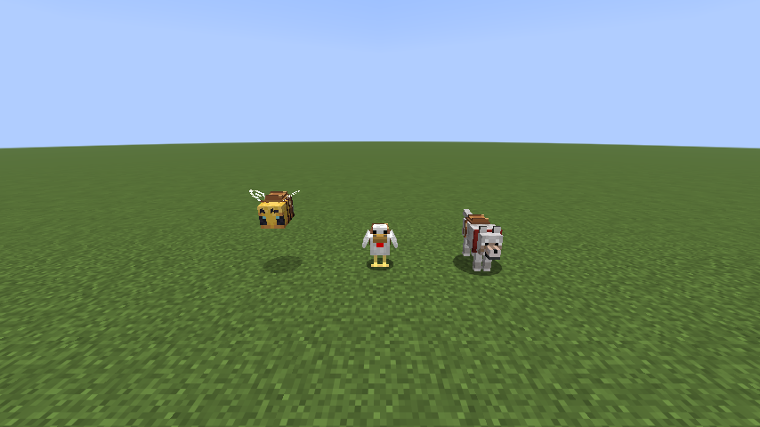

# Scale Brews

Grow beyond the doorway. Shrink beneath it. See familiar Minecraft places from a different point of view.

**Growth and Shrinking potions for Minecraft 26.2 on Fabric**, with gradual transformations, tiny mounts and a world that responds to your size.

## A different way to explore

Try walking through a half-block gap, taking a bee for a flight, or standing on a much larger friend's head. Being small and being large each bring advantages—and trade-offs.

A few things to try:

- Walk, then sprint, at different sizes. Smaller legs do not necessarily mean a slower escape.
- Take a saddle on your next trip. Some familiar animals make surprisingly useful companions.
- Bring a friend of a different size. Riding and standing on someone are not the same thing.
- Revisit familiar creatures and everyday chores after a transformation. There is more to size than reach.

*The three default tiny mounts. Saddles can be equipped at any size; riding depends on your size relative to theirs.*

## Your first brew

Brew an **Awkward Potion with a Slime Ball** to begin growing, then try a Fermented Spider Eye to reverse the idea. If Alex's Mobs Continued supplies Elastic Tendon, use that instead of the Slime Ball.

The brewing stand has more to offer. When you want the answers, the **[player guide](docs/GUIDE.md)** contains recipes, exact numbers, controls and all the less-obvious interactions. It is deliberately spoiler-rich.

One control worth knowing: for wolves, use **Crouch + Use** to mount, leaving ordinary Use for feeding, sitting and equipping. These follow your configured bindings, not hardcoded keys.

## Install

Requires **Minecraft 26.2**, **Java 25**, **Fabric Loader 0.19.5+** and **Fabric API 0.159.0+26.2 or newer for 26.2**.

1. Download the regular JAR from [GitHub releases](https://github.com/R3Neer/scale-brews/releases), not the sources JAR.
2. Put it and Fabric API in `mods`.
3. For multiplayer, install both on the server and every client.

No other mod is required. English and Spanish translations are included. World owners can tune or disable optional mechanics through [JSON configuration](docs/CONFIGURATION.md).

## Before you jump in

This is a **beta**, not a promise of compatibility with every pack. Back up worlds before updating. See [tested behavior and remaining QA](docs/VALIDATION.md).

Tiny Mounts remain ordinary Minecraft mounts at the integration boundary. When a compatible gravity provider is present, Scale-generated bee flight, chicken glide and wolf pounce/landing use the root mount's effective gravity frame instead of assuming world-down; Scale still works normally with no gravity mod installed. See [effective-gravity integration](docs/GRAVITY_INTEGRATION.md).

Living platforms currently provide upper support surfaces, **not full-body collisions**. The new all-direction anatomical system and shared Clinging Reoriented physics are **unfinished and disabled in normal gameplay**; their presence in the source is not a released feature. [Development status](docs/ANATOMY_IMPLEMENTATION.md).

## Go further

- [Player guide / wiki](docs/GUIDE.md) — the full reference, with spoilers.
- [World configuration](docs/CONFIGURATION.md) — make the rules fit your world.
- [Effective-gravity integration](docs/GRAVITY_INTEGRATION.md) — how mount-generated movement composes with optional gravity providers.
- [Build and contribute](docs/GUIDE.md#development) · [Changelog](CHANGELOG.md) · [Issues](https://github.com/R3Neer/scale-brews/issues)

[GPL-3.0-or-later](LICENSE). Original pixel art is hand-authored, not AI-generated; the images above are real in-game captures. [Artwork and screenshot details](docs/GUIDE.md#license-and-artwork).

Not an official Minecraft product. Not approved by or associated with Mojang or Microsoft.
